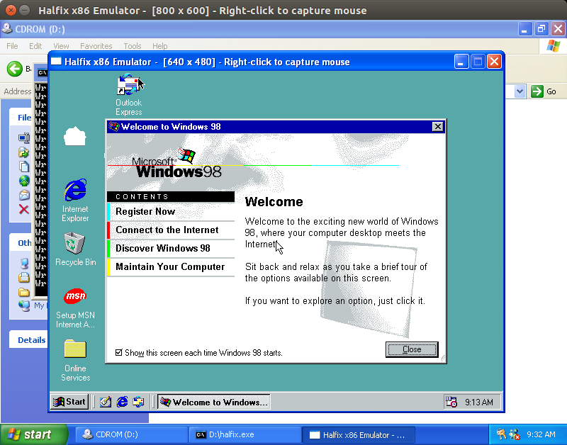
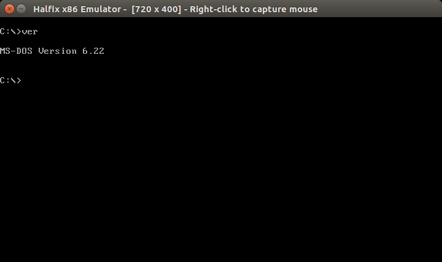
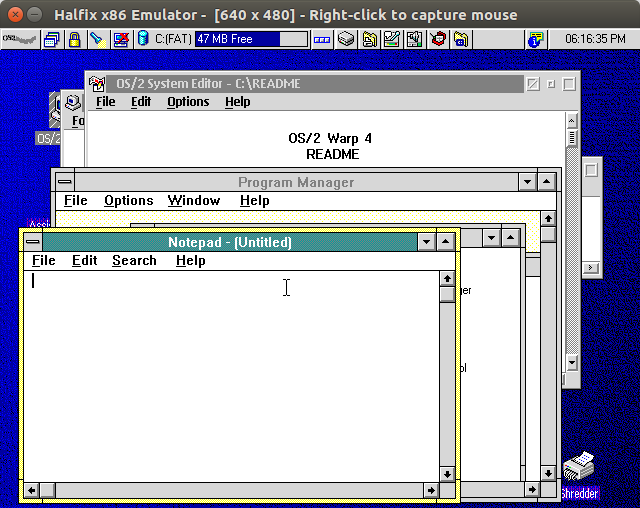
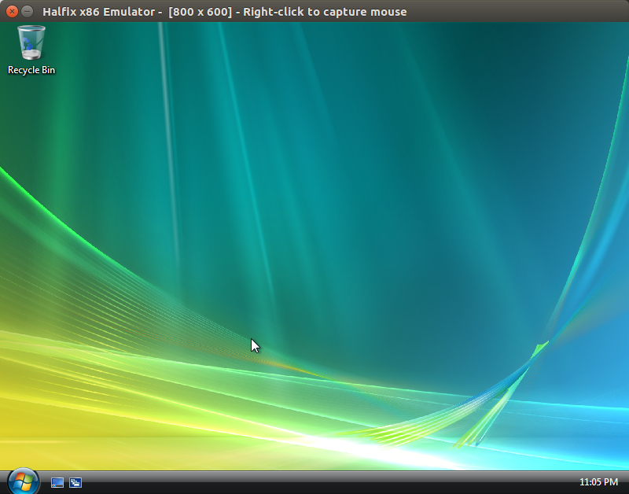
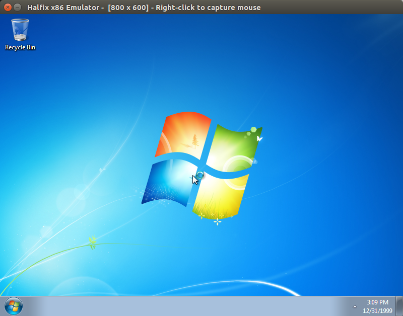
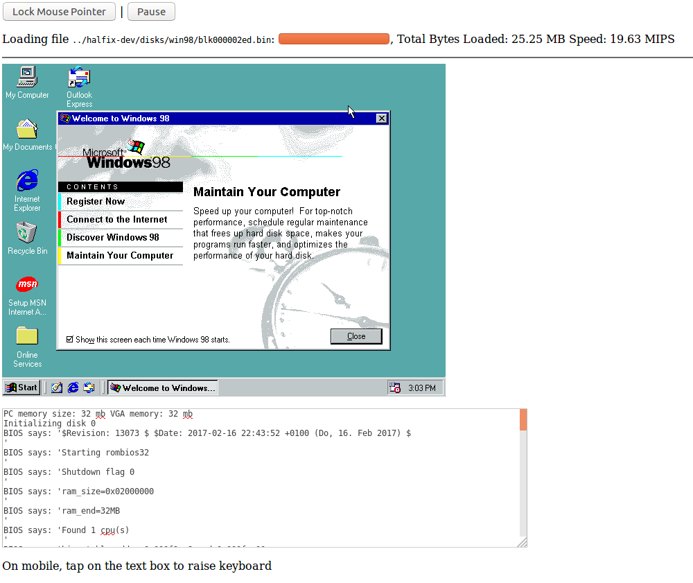
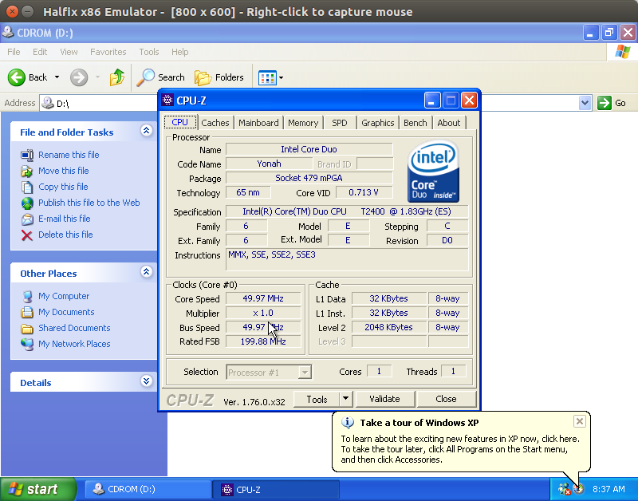
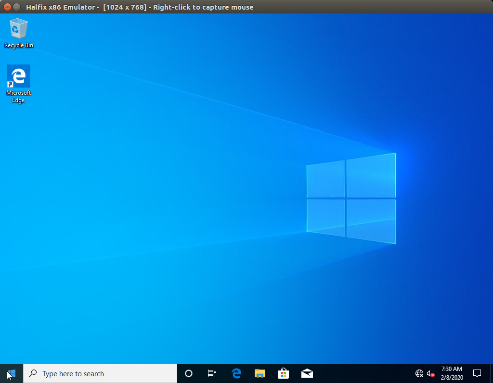
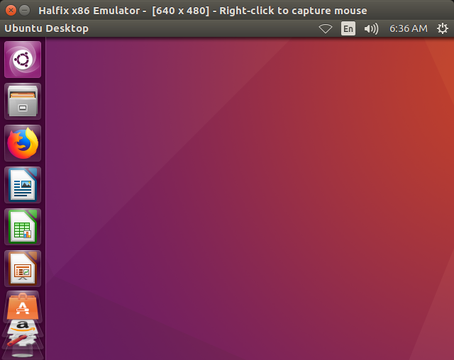

# Halfix x86 emulator

Halfix is a portable x86 emulator written in C99. It allows you to run legacy operating systems on modern platforms. 

## Why?

I made this mostly for fun, and because it was a great way to learn about the x86 PC architecture. On a more practical level, it can be used for:
 - Testing out or developing operating systems
 - Running old programs or operating systems that no longer work on modern computers or you wouldn't want to risk running on your personal computer. 
 - Simulating other x86-based systems (the CPU component can be isolated relatively easily and used in other projects)
 - Testing web browser performance

## Building and Running

This fork is focused only on Windows compatibility for now. You will need a C++20 compatible compiler, zlib, cmake and Visual Studio 2022. Only 64 bit builds are supported.

1. `cd` to the directory of halfix
2. `mkdir build && cd build`
3. `cmake .. -G "Visual Studio 17 2022" -A x64 -Thost=x64`
4. Build the resulting solution file halfix.sln with Visual Studio

## System Specifications

 - [CPU](https://github.com/nepx/halfix/tree/master/src/cpu): x86-32 (FPU, MMX, SSE, SSE2, some SSE3, PAE)
 - RAM: Configurable - anywhere from 1 MB to 3584 MB
 - Devices:
   - Intel 8259 [Programmable Interrupt Controller](https://github.com/nepx/halfix/blob/master/src/hardware/pic.c)
   - Intel 8254 [Programmable Interval Timer](https://github.com/nepx/halfix/blob/master/src/hardware/pit.c)
   - Intel 8237 [Direct Memory Access Controller](https://github.com/nepx/halfix/blob/master/src/hardware/dma.c)
   - Intel 8042 ["PS/2" Controller](https://github.com/nepx/halfix/blob/master/src/hardware/kbd.c) with attached keyboard and mouse
   - [i440FX chipset](https://github.com/nepx/halfix/blob/master/src/hardware/pci.c) (this doesn't work quite so well yet)
     - 82441FX PMC
     - 82371SB ISA-to-PCI bus
     - 82371SB IDE controller
     - [ACPI](https://github.com/nepx/halfix/blob/master/src/hardware/acpi.c) interface
   - Intel 82093AA [I/O APIC](https://github.com/nepx/halfix/blob/master/src/hardware/ioapic.c)
 - Display: Generic [VGA graphics card](https://github.com/nepx/halfix/blob/master/src/hardware/vga.c) (ET4000-compatible) with Bochs VBE extensions, optionally PCI-enabled
 - Mass Storage: 
   - Generic [IDE controller](https://github.com/nepx/halfix/blob/master/src/hardware/ide.c) (hard drive and CD-ROM) 
   - Intel 82077AA [Floppy drive controller](https://github.com/nepx/halfix/blob/master/src/hardware/fdc.c) (incomplete, but works in most cases)
 - Dummy PC speaker (no sound)

## Compatibility

It boots a wide range of operating system software, including all versions of DOS, most versions of Windows (excluding Windows 8), newer versions of OS/2 Warp (3 and 4.5), ReactOS, some varieties of Linux (ISO Linux, Damn Small Linux, Red Star OS 2, Buildroot, Ubuntu), 9Front, NeXTSTEP, several hobby OSes, and probably more. 

See [Compatibility](compatibility.md) for more details.

## Self-Virtualization

Can you run the emulator inside the emulator? 

Yes, but not very quickly. 



## Screenshots

MS-DOS



OS/2 Warp 4.5



Windows Vista



Windows 7



The same Windows 98 disk image as in the [Halfix in Halfix screenshot](docs/pics/halfix-in-halfix.png) running in Firefox



CPU-Z on Windows XP



Windows 10



Ubuntu



## Transferring Files

Create a directory with all the files you want to transfer and create an ISO image. 

```
mkisofs -o programs.iso -max-iso9660-filenames -iso-level 4 programs/
```

Now update the configuration file as follows:

```
# Note: it does not hae to be ata0-slave. 
# I have not tested it with anything but ata0-slave.
[ata0-slave]
inserted=1
type=cd
file=/tmp/programs.iso
driver=sync
```

Now boot up your operating system and copy the files from the CD-ROM to the hard drive. 

## Known Issues
 - SSE3 is not fully supported
 - Performance isn't terrible, but it isn't fantastic either (70-100 MIPS native, 10-30 MIPS browser)
 - Timing is completely off
 - Windows 8 doesn't boot (see [this issue](https://github.com/nepx/halfix/issues/1))
 - FPU exceptions are probably very incorrect
 - Most devices aren't complete, but enough is implemented to boot modern OSes. 
 - The configuration file parser isn't very good

## License

GNU General Public License version 3

## Similar Projects

 - [v86](https://www.github.com/copy/v86)
 - [JSLinux](http://bellard.org/jslinux/)
 - [jemul8](http://www.github.com/asmblah/jemul8)

## Credits

The FPU emulator uses an modified version of [Berkeley SoftFloat](jhauser.us/arithmetic/SoftFloat.html) from the [Bochs](bochs.sourceforge.net) emulator. 
